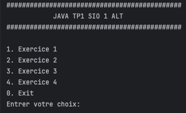
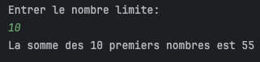
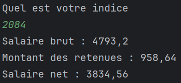
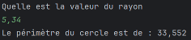

# JAVA TP1 SIO 1

## Description

Réaliser un menu interactif en console permettant d'éxécuter les exercices définis ci-dessous.

**Exemple du menu :**

## Exercice n°1

On souhaite calculer l’aire d’un carré dont la valeur du côté est renseigner par l'utilisateur.

**Résultat attendu :**

## Exercice n°2

Écrire un programme Java pour calculer la somme des n premiers nombres naturels.

**Résultat attendu :**

## Exercice n°3

On souhaite calculer le salaire d'un fonctionnaire à partir de son indice, fourni par l'utilisateur.
- Le salaire brut se calcule en multipliant l’indice avec la valeur du point qui est de 2,30 euros.
- Les retenues représentent 2/10 de son salaire brut.
- On affichera le salaire brut, le montant des retenues et le salaire net.

**Résultat attendu :**

## Exercice n°4
On souhaite calculer le périmètre d’un cercle dont l’utilisateur saisira le rayon.

**Rappel :**
- Périmètre = 2 * pi * r 
- Avec pi = 3,141592

**Résultat attendu :**

